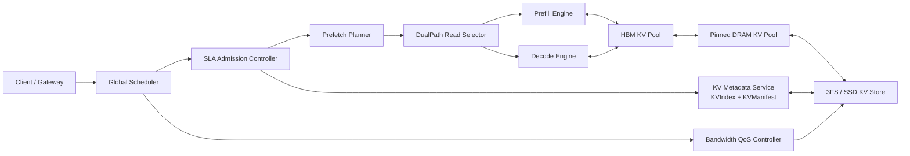
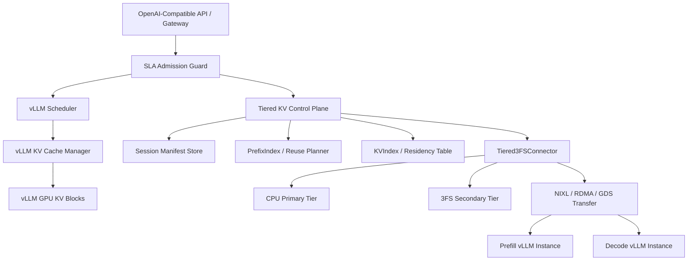

# 1M Tokens KV Cache 分层管理技术方案

版本：v0.5
日期：2026-05-24
范围：面向 Agent 长上下文、多轮交互和科学发现推理的精确 attention 多级 KV Cache 管理

## 1. 摘要

本方案设计一套面向最长 `1M tokens` 上下文窗口的反池化 KV 多级存储系统。系统将 `HBM / DRAM / 3FS(SSD)` 组织成由推理引擎显式调度的三层 KV 存储层级：HBM 与 DRAM 承载在线热工作集，3FS/SSD 承载冷 KV 容量层，并通过预取、驱逐、准入控制和带宽 QoS 保证业务 SLA。

第一版坚持精确 attention 语义，不引入有损 KV 压缩、稀疏近似或语义检索替代。3FS/SSD 不进入 decode 同步读路径；所有本轮 decode 必需 KV 必须在 decode 前通过 admission/prefetch 补齐到 HBM 或 DRAM。若调度器判定无法满足 SLA，则请求不得进入精确 1M SLA 队列。

本课题要解决的问题不是单纯扩容存储，而是把“百万级上下文请求是否可被稳定承载”变成可预测、可准入、可观测、可降级的系统问题。对多轮 Agent、长会话、共享前缀和复杂科学推理这类存在复用或时序局部性的负载，系统应在不改变模型精确语义的前提下，将冷 KV 下沉到 3FS，并在后续轮次中复用历史 prefill KV，只对新增 token 做 delta prefill；同时在真正 decode 前完成 critical KV 的恢复和驻留确认。对完全冷启动且不可提前预取的 1M 请求，系统不承诺固定 TTFT，而应诚实地延迟、迁移或拒绝精确 SLA 队列。

因此本方案的核心被拆成两个同等重要的闭环：

- **Prefill 侧**：避免每轮重新计算 1M 历史上下文，将 committed prefix/session KV 复用为本轮上下文基础。
- **Decode 侧**：保证被准入请求的 required KV 已在 HBM/DRAM 可达集合中，避免同步读取 3FS/SSD。

硬性验收指标如下：

| 指标 | 第一版阈值 | 说明 |
| --- | --- | --- |
| 最大上下文 | `1M tokens` | 单请求长会话上下文窗口 |
| TTFT | `TTFT_offload <= 1.2 * TTFT_DRAM_baseline` | 基线为无 SSD 卸载、但有足够 HBM/DRAM 的 DRAM 扩容方案 |
| 多级 KV 命中率 | `>= 90%` | 针对有复用或时序局部性的适用场景 |
| 历史 prefill 重算 | committed ranges 默认 `0` 全量重算 | 多轮长会话只允许对新增 token 做 delta prefill，除非 correctness key 不匹配 |
| 带宽警戒线 | `storage/network sustained utilization <= 70%` | 生产阈值可替换此默认值 |
| 同步 SSD miss | SLA 队列中应为 `0` | 出现则暂停该 sequence 并重排，不阻塞其他 sequence |

## 2. 问题定义与设计原则

### 2.1 研究问题

百万级上下文推理的瓶颈可以拆成四个相互耦合的问题：

1. **容量问题**：1M tokens 的 KV 可能远超单卡 HBM，甚至给 DRAM 带来显著压力，必须有外部容量层承载长尾历史 KV、idle session 和共享前缀。
2. **Prefill 重算问题**：如果每轮多轮 Agent 都重新 prefill 1M 历史上下文，TTFT 会被计算成本主导，即使 decode 侧没有 miss 也无法服务化。
3. **Decode 时延问题**：精确 dense attention 在 decode 阶段仍会访问历史 KV，若将 SSD/3FS 同步读放进 critical path，TTFT 和 TPOT 会被 I/O tail latency 放大。
4. **服务治理问题**：长上下文请求的大规模预取、写回和跨机 KV 迁移会竞争存储网卡、RDMA 和 CPU pinned memory，必须被纳入调度闭环，否则会拖垮短请求尾延迟。

因此系统目标不是“所有 KV 都可从磁盘透明访问”，而是“所有被准入的 1M 精确请求，其历史 prefill KV 可被复用，新增 token 可被 delta prefill，decode 所需 KV 已经在执行前进入 HBM/DRAM 可达集合”。

### 2.2 内存是执行层，3FS/SSD 是容量层

系统采用和 Anti-Caching 相同的反向缓存思路：不是让磁盘成为 primary storage、内存做被动缓存，而是把在线执行所需 KV 显式保持在 HBM/DRAM，将冷 KV 下沉到 3FS/SSD。推理引擎负责每个 KV block 的位置、热度、版本和读写时机，避免 OS page fault 或文件系统缓存策略决定 GPU 执行是否被卡住。

### 2.3 Decode critical path 不允许同步读 SSD

标准 dense attention 在 decode 每生成一个 token 时都可能访问历史 KV。若 1M token 的大量 KV 在 SSD 上同步读取，单 token 延迟会被存储 I/O 放大，无法稳定满足 TPOT/TTFT。因此第一版只允许 3FS/SSD 在以下阶段参与：

- 请求准入前的 KV 恢复与预取。
- prefill 与 decode 切换前的 KV 补齐。
- idle session 恢复。
- 后台驱逐、压实和持久化。

### 2.4 指标进入调度闭环

TTFT、命中率和带宽不是离线报表，而是准入控制与调度决策的输入。调度器必须在接入 1M 请求前估算：

```text
TTFT_predicted =
  queue_delay
  + manifest_lookup_time
  + prefix_match_time
  + reusable_kv_restore_time
  + delta_prefill_time
  + first_decode_step_time
TTFT_predicted <= 1.2 * TTFT_DRAM_baseline
```

若任一约束不满足，系统执行延迟接入、迁移、降级或拒绝，而不是让请求进入执行后再暴露长尾延迟。

### 2.5 精确优先与后续扩展解耦

压缩、量化、稀疏注意力、语义检索和选择性 KV 保留都可能进一步提升容量效率，但它们改变了误差模型、验收口径或产品语义。第一版只把这些能力作为可插拔后续扩展，主方案的评测和 SLA 均以精确 attention 为准。

### 2.6 我们准备怎么做

本方案可以理解为在 vLLM 外围增加一个“KV 管家”：它不改变模型语义，也不把 SSD 伪装成显存，而是在请求进入 vLLM 之前先回答四个问题：

1. 这段历史 KV 是否仍然正确，能不能复用？
2. 当前 admission window 内是否有多条请求可以共享同一段 KV？
3. 如果能复用，它现在位于 HBM、DRAM 还是 3FS？
4. 如果它还在 3FS，能不能在 SLA deadline 前恢复到 DRAM/HBM？
5. 如果不能，是否应该等待、迁移、降级、full prefill 回退或拒绝精确 SLA？

整体执行路径如下：

```text
Gateway
  -> SLA Admission Guard
  -> KVCorrectnessKey / PrefixIndex / KVManifest lookup
  -> KVSharingPlan across admission window
  -> PrefillReusePlan
  -> KVIndex residency lookup
  -> PrefetchPlan / 3FS restore
  -> delta prefill
  -> decode ready barrier
  -> vLLM decode scheduler
  -> async writeback / eviction / metrics
```

因此系统要做的不是“把 KV 存进 3FS”这一件事，而是把 1M 上下文的 KV 从 GPU 临时缓存升级为可复用、可恢复、可调度、可准入的数据系统：

- **KV 元数据系统**：用 `KVManifest`、`PrefixIndex`、`KVIndex` 和 `KVCorrectnessKey` 描述 KV 的正确性、归属、版本和驻留位置。
- **Prefill 复用规划器**：生成 `PrefillReusePlan`，复用 committed ranges 和 shared prefix，只对新增 token 做 delta prefill。
- **3FS 分层 connector**：通过 `Tiered3FSConnector` 批量写入、恢复和预取 KV，禁止 decode 同步读 3FS。
- **准入控制器**：预测 TTFT、prefill 复用率、decode 命中率、3FS/RDMA 带宽和队列压力，决定请求能否进入精确 SLA 队列。
- **Decode ready barrier**：进入 decode batch 前强制检查 required KV 是否 ready；未 ready 的请求不能进入 batch。
- **QoS 与监控闭环**：保护短请求，限制长请求预取和后台写回，持续观测 prefill 复用率、有效命中率、同步 miss、3FS tail latency 和带宽。

一个典型多轮长会话例子如下：

```text
第 1 轮：
  full prefill 1M tokens
  -> 生成 KV
  -> HBM/DRAM 热驻留
  -> 后台写入 3FS segment
  -> 提交 KVManifest
  -> decode

第 2 轮：
  用户追加 2K tokens
  -> 查 KVManifest/PrefixIndex，确认前 1M KV 可复用
  -> 若部分历史 KV 在 3FS，提前恢复到 DRAM/HBM
  -> 只对新增 2K tokens 做 delta prefill
  -> ready barrier 检查通过
  -> decode
```

第 2 轮的成本不再是重新计算 `1M + 2K` tokens，而是：

```text
历史 KV 恢复 + 2K delta prefill + first decode step
```

这就是本方案希望实现的服务化路径：Prefill 侧不重算历史，Decode 侧不等待 SSD，Admission/QoS 侧不让长上下文请求拖垮整体服务。

## 3. 系统架构



### 3.1 三层职责

| 层级 | 作用 | 典型数据 | 约束 |
| --- | --- | --- | --- |
| HBM | GPU 直接参与 attention 的热 KV | 当前 batch、当前 decode window、即将访问的 layer blocks | 容量最小、延迟最敏感 |
| DRAM | HBM 的 warm backing store | 已预取但暂未进 HBM、刚从 HBM 降级、近期可能再次访问的 KV | 需要 pinned/page-locked，支持高速 H2D |
| 3FS/SSD | 长上下文冷容量层 | 长尾历史 KV、idle session、共享前缀持久化 KV | 只允许异步预取，不允许 SLA decode 同步读 |

### 3.2 KV block 粒度

默认按 `64 tokens` 切分 KV block。该粒度用于第一版实验，后续通过消融比较 `32 / 64 / 128 / 256 tokens`。

推荐采用两级逻辑：

- `FullBlock`：3FS/SSD 上的持久化对象，覆盖一个 token range 的多层 KV。
- `LayerBlock`：执行与传输调度单元，覆盖一个 token range 的单层或 layer group KV。

这样可以同时满足 3FS 顺序读效率和 GPU layerwise attention 的细粒度调度。3FS 对大块顺序读更友好，HBM 则需要按 layer 和 batch 做精细驻留。

### 3.3 KV 容量估算

通用估算公式：

```text
kv_bytes_per_token = 2 * num_layers * num_kv_heads * head_dim * dtype_bytes
kv_total_bytes = context_tokens * kv_bytes_per_token
```

若模型使用 MLA、GQA、MQA 或 FP8 KV，应将 `num_kv_heads * head_dim * dtype_bytes` 替换为实际 KV 表示。方案文档不假设具体模型结构，真实部署必须在 `KVManifest` 中记录模型版本与 KV layout。

### 3.4 反池化 KV 的核心闭环

反池化 KV 系统由四个闭环组成：

| 闭环 | 输入 | 决策 | 输出 |
| --- | --- | --- | --- |
| 驻留闭环 | `KVIndex`、HBM/DRAM 水位、访问历史 | 哪些 block 留在 HBM/DRAM，哪些下沉到 3FS | residency 转换、驱逐任务、写回任务 |
| Prefill 复用闭环 | `KVManifest`、prefix/session hash、token ranges | 复用哪些历史 KV，只计算哪些新增 token | `PrefillReusePlan`、delta prefill ranges |
| 准入闭环 | TTFT baseline、required blocks、3FS/RDMA 负载 | 是否准入、延迟、迁移或拒绝 | `SchedulerDecision` |
| 预取闭环 | `PrefetchPlan`、deadline、DualPath 资源 | 从哪个路径批量恢复 KV | ready blocks、deadline miss 指标 |
| 服务隔离闭环 | 短请求尾延迟、长请求队列、后台写回 | 限速、暂停后台任务、降低长请求并发 | QoS 配额、告警和降级事件 |

这四个闭环共同保证：3FS 提供容量，但不在已准入 decode 的同步读路径上决定时延。

## 4. 相关工作与差异化定位

### 4.1 Anti-Caching 到 KV 反池化的映射

Anti-Caching 提出的核心思想是：主内存系统不应依赖 OS 虚拟内存透明换页，而应由数据库自己识别冷对象、写出冷对象、维护内存目录，并在访问冷对象时非阻塞取回。迁移到 KV Cache 后，对应关系如下：

| Anti-Caching 概念 | KV 反池化对应物 | 迁移方式 |
| --- | --- | --- |
| tuple-level eviction | token/layer block 粒度驱逐 | 按 `LayerBlock` 或 layer group 而非 OS page 做驻留决策 |
| Evicted Table | `KVIndex` | 内存常驻目录，记录 block residency、offset、checksum、pin/refcount |
| Block Table | 3FS segment store | 冷 KV 聚合成 segment，避免大量小文件 |
| pre-pass | required KV block 解析 | decode 前一次性识别 critical blocks，批量预取 |
| abort/restart | sequence pause/requeue | 意外 miss 不阻塞整个 batch，fetch 完成后重排 |
| block holes/compaction | segment rewrite | 后台压实半空 segment，降低读放大 |

Anti-Caching 原型有一个重要边界：单个事务的工作集默认仍应能进入内存。对 1M dense attention，这等价于“本轮 decode 的 critical KV 工作集必须能在 HBM/DRAM 中被调度承载”。如果这个条件不成立，SSD 层无法靠同步读取补救 SLA。

### 4.2 LLM 推理侧已有工作

| 方向 | 代表工作 | 与本方案关系 |
| --- | --- | --- |
| GPU KV block 管理 | vLLM PagedAttention、automatic prefix caching | 作为 HBM 层和共享前缀复用基础，避免重写 attention 内核 |
| KVCache-centric disaggregation | Mooncake、vLLM disaggregated prefill | 作为 prefill/decode 分离、跨实例 KV 迁移和资源池化基础 |
| 多级 KV 缓存与外部存储 | LMCache、SGLang HiCache、KVDrive、Tutti | 提供 CPU/disk/远端 KV 存储经验，本方案补 SLA 准入与 3FS 感知治理 |
| 存储路径与带宽调度 | DualPath | 采用 storage-to-prefill 与 storage-to-decode 双路径思想，并纳入全局 QoS |
| 压缩与近似 | CacheGen、KIVI、KV 压缩/量化、稀疏注意力 | 第一版不纳入主路径，只作为扩展接口 |

### 4.3 本方案的差异化落点

已有工作已经覆盖了“KV 可以跨 GPU/CPU/磁盘/远端移动”这一基本能力，因此本方案不能只表述为分层缓存。差异化应收敛到三点：

1. **面向 1M 精确上下文的准入控制**：将 `TTFT_offload <= 1.2 * TTFT_DRAM_baseline`、有效命中率和同步 miss 为 0 作为进入执行队列的硬门槛。
2. **3FS 感知的控制平面**：把 3FS queue depth、tail latency、存储网卡、RDMA KV 迁移和后台写回纳入同一个调度模型。
3. **在线服务隔离**：短请求、长请求、预取、恢复、写回和压实分队列治理，避免长上下文能力破坏普通服务尾延迟。

### 4.4 参考技术来源

- Anti-Caching 论文：本地文件 [p1942-debrabant.pdf](p1942-debrabant.pdf)，核心启发是显式冷数据下沉、内存元数据索引、非阻塞取回和 pre-pass 批量识别缺失数据。
- Multi-Query Optimization for CEP in SAP ESP：本地文件 [Multi-Query_Optimization_for_Complex_Event_Processing_in_SAP_ESP.pdf](Multi-Query_Optimization_for_Complex_Event_Processing_in_SAP_ESP.pdf)，核心启发是把一组相似请求先重写成共享执行计划，再用成本模型选择哪些中间结果值得物化和复用。
- 3FS：DeepSeek 公开的 [Fire-Flyer File System](https://github.com/deepseek-ai/3FS)，面向 AI 训练与推理负载，使用 SSD 与 RDMA 提供共享存储层，并展示了 KVCache inference 场景。
- vLLM：PagedAttention、automatic prefix caching、disaggregated prefill 和 KV transfer connector 是第一版落地基础。
- DualPath：论文 [DualPath: Breaking the Storage Bandwidth Bottleneck in Agentic LLM Inference](https://arxiv.org/abs/2602.21548)，提出 storage-to-prefill 与 storage-to-decode 双路径加载，并用全局调度缓解 prefill engine storage NIC 饱和。
- Mooncake、LMCache、SGLang HiCache、KVDrive、Tutti：作为 KV 多级缓存、解耦服务和 SSD-backed KV 系统的主要对比对象。

### 4.5 MOTTO 多查询优化对 KV 命中率的启发

MOTTO 面向 CEP 的问题是：大量 pattern queries 运行在同一批事件流上，如果每个查询独立执行，会重复计算相同子模式。它的解决方式不是优化某一个查询，而是将一批查询组成 Jumbo Query Plan，通过 query rewriter 发现共享机会，再由 query planner 和成本模型选择全局最优或近似最优的共享执行计划。

这对 KV 多级存储的启发是：`>=90%` 命中率不能只依赖单请求 LRU，也不能只等待请求自然命中。系统应把一个 admission window 内的多条长上下文请求视为一个 workload，主动发现可共享 KV 子结构，并决定哪些 KV 应提前物化、驻留或预取。

| MOTTO 思想 | KV 多级存储对应设计 | 命中率价值 |
| --- | --- | --- |
| Jumbo Query Plan | `KVSharingPlan`：一批请求的共享 KV 计划 | 从单请求缓存变成多请求全局复用 |
| Merge sharing | 完全相同 prefix/session range 直接共享同一 KV blocks | 提高 shared prefix 和 session 命中率 |
| Decomposition sharing | 将长 prompt / agent trace 拆成文档段、system prompt、tool output、turn ranges | 发现非完整前缀的公共子段，提升可复用面积 |
| Operator transformation | 在不改变 token 序列和 correctness key 的前提下做请求规范化 | 减少因为模板、分段、metadata 差异造成的伪 miss |
| Different window constraints | 按 TTL、SLA deadline、会话活跃窗口决定是否扩展或缩小共享驻留窗口 | 避免为了低收益共享占满 DRAM |
| Nested query support | 将嵌套 agent trace / tool chain 拆成内层可复用 KV 对象 | 对复杂 Agent 流程复用稳定内层上下文 |
| Cost model + DSMT | 以 saved prefill、未来命中率、DRAM/HBM 成本和 3FS 预取成本选择物化对象 | 让驻留和预取服务于全局命中率 |

迁移时要注意一个边界：CEP 的 operator transformation 可以通过过滤保持语义等价；KV 复用更严格，只有 token 序列、position、attention mask、模型版本和 `KVCorrectnessKey` 完全匹配时才允许直接共享。这里的“变换”只能用于规范化请求表示和发现共享候选，不能把不相同的 token KV 当作相同 KV 复用。

## 5. 核心接口与元数据

### 5.1 KVBlockId

```ts
type KVBlockId = {
  session_id: string;
  model_id: string;
  layer_group: number;
  token_start: number;
  token_count: number;
  kv_layout: "MHA" | "GQA" | "MQA" | "MLA" | string;
  dtype: "fp16" | "bf16" | "fp8" | string;
  version: number;
};
```

### 5.2 KVCorrectnessKey

Prefill KV 复用必须先证明“这段 KV 仍然语义等价”。仅按 token range 查找不够，因为模型版本、tokenizer、位置编码、LoRA/adapter、prompt template 或 attention mask 任一变化都会使历史 KV 不可复用。

```ts
type KVCorrectnessKey = {
  model_id: string;
  model_revision: string;
  tokenizer_revision: string;
  kv_layout: "MHA" | "GQA" | "MQA" | "MLA" | string;
  dtype: "fp16" | "bf16" | "fp8" | string;
  rope_scaling?: string;
  position_base?: number;
  attention_mask_digest: string;
  prompt_template_digest: string;
  adapter_digest?: string;
};
```

约束：

- 只有 `KVCorrectnessKey` 完全匹配的 committed KV 才能进入 prefill 复用。
- 允许不同请求共享 prefix KV，但必须共享相同 token 序列、position 区间和 correctness key。
- 若任一字段不匹配，系统必须退回 full prefill 或拒绝精确复用路径，不能做模糊复用。

### 5.3 KVResidency

```ts
type KVResidency = "HBM" | "DRAM" | "SSD" | "FETCHING" | "EVICTING" | "COMPACTING";
```

### 5.4 KVIndex

`KVIndex` 是内存常驻目录，负责将逻辑 KV block 映射到物理位置。

```ts
type KVIndexEntry = {
  block_id: KVBlockId;
  residency: KVResidency;
  hbm_addr?: string;
  dram_addr?: string;
  fs_path?: string;
  fs_offset?: number;
  byte_len: number;
  checksum: string;
  refcount: number;
  pin_count: number;
  last_access_ts: number;
  sampled_access_score: number;
  predicted_next_use_ts?: number;
  sla_priority: "critical" | "normal" | "background";
};
```

约束：

- `KVIndex` 必须完全驻留 DRAM，不能依赖 3FS 同步查询。
- 每次 KV 迁移必须先进入 `FETCHING` 或 `EVICTING` 状态，完成校验后再切换 residency。
- `pin_count > 0` 的 block 不允许驱逐。

### 5.5 KVManifest

`KVManifest` 是 session 级元数据，记录上下文范围、共享前缀、版本和恢复点。

```ts
type KVManifest = {
  session_id: string;
  model_id: string;
  max_context_tokens: 1_000_000;
  committed_ranges: Array<[number, number]>;
  shared_prefix_id?: string;
  block_size_tokens: number;
  current_turn: number;
  manifest_version: number;
  correctness_key: KVCorrectnessKey;
  blocks: KVBlockId[];
  recovery_state: "ACTIVE" | "IDLE" | "RECOVERING" | "CLOSED";
};
```

### 5.6 PrefixIndex

`PrefixIndex` 是跨 session 的 prefix 目录，用于复用系统 prompt、长文档、工具轨迹和科学材料库等稳定前缀。它不替代 `KVManifest`，而是为多个 session 指向同一组 committed KV blocks。

```ts
type PrefixIndexEntry = {
  prefix_id: string;
  correctness_key: KVCorrectnessKey;
  token_digest: string;
  token_start: number;
  token_count: number;
  block_ids: KVBlockId[];
  refcount: number;
  last_access_ts: number;
  residency_summary: Record<KVResidency, number>;
};
```

### 5.7 PrefillReusePlan

```ts
type PrefillReusePlan = {
  request_id: string;
  reusable_ranges: Array<[number, number]>;
  delta_prefill_ranges: Array<[number, number]>;
  reused_blocks: KVBlockId[];
  delta_tokens: number;
  full_context_tokens: number;
  prefix_cache_hit: boolean;
  session_cache_hit: boolean;
  expected_prefill_tokens_saved: number;
  fallback: "delta_prefill" | "full_prefill" | "reject_exact_sla";
  reason?: string;
};
```

语义：

- `reusable_ranges` 必须覆盖所有可证明等价的 committed KV。
- `delta_prefill_ranges` 只包含新增 user turn、tool result 或未命中的 suffix。
- 对多轮长会话，正常路径应为 `delta_prefill`；`full_prefill` 是冷启动或 correctness key 不匹配时的回退。

### 5.8 KVSharingPlan

`KVSharingPlan` 借鉴 MOTTO 的 Jumbo Query Plan，用于在一个 admission window 内对多条长上下文请求做全局共享规划。它不是单个请求的复用计划，而是一批请求的共享 KV 物化、驻留和预取决策。

```ts
type KVSharingCandidate = {
  candidate_id: string;
  candidate_type: "exact_prefix" | "session_range" | "common_subrange" | "nested_trace_range";
  correctness_key: KVCorrectnessKey;
  token_digest: string;
  token_start: number;
  token_count: number;
  beneficiary_request_ids: string[];
  source: "manifest" | "prefix_index" | "new_delta_prefill";
  expected_reuse_count: number;
  expected_prefill_tokens_saved: number;
  expected_decode_hits: number;
  materialize_cost_bytes: number;
  restore_cost_ms: number;
  residency_target: "HBM" | "DRAM" | "3FS";
};

type KVSharingPlan = {
  planning_window_id: string;
  request_ids: string[];
  candidates: KVSharingCandidate[];
  selected_candidate_ids: string[];
  estimated_hit_rate_after_plan: number;
  estimated_prefill_tokens_saved: number;
  estimated_storage_read_bytes: number;
  estimated_dram_bytes: number;
};
```

候选来源：

- **Merge-style candidate**：多个请求拥有相同 prefix、相同 session committed range 或相同 shared document。
- **Decomposition-style candidate**：长上下文中存在共同子段，例如相同 system prompt、论文正文、工具 schema、agent trace 内层步骤。
- **Window-aware candidate**：请求的 deadline、TTL 和会话活跃窗口不同，只选择在收益大于驻留/预取成本时共享。
- **Nested-trace candidate**：复杂 Agent 工作流中内层 tool result、实验记录或科学材料库可被多轮外层问题复用。

### 5.9 PrefetchPlan

```ts
type PrefetchPlan = {
  request_id: string;
  required_blocks: KVBlockId[];
  optional_blocks: KVBlockId[];
  deadline_ms: number;
  target_engine: string;
  read_path: "storage_to_prefill" | "storage_to_decode";
  estimated_bytes: number;
  expected_hit_rate: number;
};
```

### 5.10 SchedulerDecision

```ts
type SchedulerDecision = {
  request_id: string;
  admit: boolean;
  prefill_engine?: string;
  decode_engine?: string;
  read_path?: "storage_to_prefill" | "storage_to_decode";
  prefill_reuse_plan?: PrefillReusePlan;
  kv_sharing_plan_id?: string;
  ttft_budget_ms: number;
  ttft_predicted_ms: number;
  bandwidth_predicted_utilization: number;
  fallback: "run" | "delay" | "migrate" | "reject_exact_sla";
  reason?: string;
};
```

## 6. 请求生命周期

### 6.1 Admission

请求进入系统后，调度器执行以下步骤：

1. 读取 `KVManifest`，确认 session、model、KV layout 和上下文范围。
2. 构造 `KVCorrectnessKey`，与 session manifest 和 `PrefixIndex` 做精确匹配。
3. 生成 `PrefillReusePlan`，区分可复用历史 KV 与新增 token 的 delta prefill range。
4. 根据 reuse plan、decode 目标和共享前缀计算 required KV blocks。
5. 查询 `KVIndex`，统计 HBM/DRAM/SSD/FETCHING 的驻留分布。
6. 估算 reusable KV restore time、delta prefill time、queue delay 和首 token 计算时间。
7. 判断 TTFT、prefill 复用率、命中率和带宽是否满足硬约束。

准入伪代码：

```text
baseline = TTFT_DRAM_baseline(model_id, context_tokens, batch_shape)
budget = 1.2 * baseline

reuse_plan = plan_prefill_reuse(request, manifest, prefix_index)
required = plan_required_blocks(request, reuse_plan)
state = lookup_residency(required)
prefetch_bytes = bytes(state.SSD + state.FETCHING_not_for_this_request)
restore_time = estimate_prefetch(prefetch_bytes, current_3fs_bw, queue_depth)
delta_prefill_time = estimate_delta_prefill(reuse_plan.delta_tokens, batch_shape)
ttft_pred =
    queue_delay
  + metadata_time
  + prefix_match_time
  + restore_time
  + delta_prefill_time
  + compute_time_to_first_token
hit_rate_pred = estimate_effective_hit_rate(required, state, prefetch_plan)
prefill_reuse_pred = reuse_plan.expected_prefill_tokens_saved / reuse_plan.full_context_tokens
bandwidth_pred = estimate_sustained_utilization(prefetch_bytes)

if ttft_pred <= budget and prefill_reuse_pred is acceptable and hit_rate_pred >= 0.90 and bandwidth_pred <= 0.70:
    admit(request)
else:
    delay_or_migrate_or_reject_exact_sla(request)
```

### 6.2 Prefill 复用与增量预填充

Prefill 优化的目标是避免多轮长会话每轮重算历史上下文。系统把上下文拆成两部分：

- **Committed KV ranges**：已经完成 prefill、通过 manifest 提交且 correctness key 匹配的历史 KV。
- **Delta prefill ranges**：本轮新增 user turn、tool result、检索结果或未命中的 suffix。

标准长会话路径如下：

```text
turn 1: full prefill [0, N) -> commit KV manifest -> decode
turn 2: reuse [0, N), delta prefill [N, N+d1) -> commit -> decode
turn k: reuse [0, Nk), delta prefill [Nk, Nk+dk) -> commit -> decode
```

复用判定必须满足：

- token 序列完全一致，且 position range 完全一致。
- `KVCorrectnessKey` 完全匹配。
- 对 shared prefix，`PrefixIndex` 的 `token_digest` 与请求前缀一致。
- 对 session 追加，`KVManifest.committed_ranges` 必须连续覆盖复用区间。
- 复用 blocks 必须在 decode 前恢复到 HBM/DRAM 可达集合，或在 prefill engine 可按 deadline 消费。

如果复用失败：

1. correctness key 不匹配：进入 full prefill 或拒绝精确复用路径。
2. prefix 部分命中：复用 longest valid prefix，对 suffix 做 delta prefill。
3. manifest 缺块或校验失败：进入 `RECOVERING`，由上层选择重算、等待恢复或返回可重试错误。

### 6.3 Pre-pass

Pre-pass 借鉴 Anti-Caching：在真正执行前，先解析请求会访问的 KV block 集合，避免每次遇到缺失 block 才触发一次 I/O。

对长会话 prefill/decode，pre-pass 的输入包括：

- 当前 session 的 committed context range。
- 新增 prompt 或 tool result 的 token range。
- 模型 layer/layer-group KV layout。
- attention mask、sliding/full attention 配置。
- batch packing 决策。
- `PrefillReusePlan` 中的 reusable ranges 与 delta prefill ranges。

输出包括两类计划：

- `PrefillReusePlan`：描述哪些历史 KV 可以复用、哪些 token 必须 delta prefill。
- `PrefetchPlan.required_blocks`：描述复用历史 KV 和本轮 decode 所需 KV 的恢复集合。

对精确 dense attention，required blocks 必须覆盖本轮 prefill/decode 所有历史可见 KV。

### 6.4 Prefetch

Prefetch planner 将 required blocks 分为三类：

- 已在 HBM：直接 pin。
- 已在 DRAM：根据 layer schedule 提前 H2D。
- 在 3FS/SSD：发起异步批量读，先进入 DRAM，再按需要进入 HBM。

Prefetch 必须满足：

- 所有 critical blocks 在 `deadline_ms` 前 ready。
- 对同一 `KVBlockId` 的并发读取合并为一个 in-flight fetch。
- 已发起 prefetch 的 block 标记为 `FETCHING`，避免被重复驱逐或重复读取。
- 读完成后校验 checksum，再更新 `KVIndex` residency。

Prefill 复用场景下，prefetch 的优先级分为：

| 优先级 | 数据 | 目的 |
| --- | --- | --- |
| P0 | 本轮 delta prefill 前必须消费的 shared/session prefix KV | 避免 prefill engine 重算历史上下文 |
| P1 | 本轮 decode required KV | 保证 decode 前 ready |
| P2 | 下一轮可能复用的 hot prefix 或 active session KV | 提升后续 TTFT |
| P3 | idle session 预热、后台恢复、compaction | 只使用剩余带宽 |

### 6.5 DualPath 读路径选择

系统支持两条读路径：

| 路径 | 数据流 | 适用条件 |
| --- | --- | --- |
| `storage_to_prefill` | 3FS -> Prefill Engine -> DRAM/HBM | prefill engine storage NIC 空闲、请求即将进入 delta prefill，或需要恢复 shared/session prefix KV |
| `storage_to_decode` | 3FS -> Decode Engine -> RDMA -> Prefill Engine 或本地 decode | decode engine storage NIC 空闲、prefill engine storage NIC 接近饱和 |

选择策略：

```text
if PE_storage_util < 0.60 and PE_queue_depth is low:
    use storage_to_prefill
else if DE_storage_util < 0.60 and compute_network_has_headroom:
    use storage_to_decode
else:
    delay admission or split prefetch window
```

模型执行通信优先级高于 KV 迁移通信。若 RDMA KV 迁移与 tensor parallel / pipeline parallel 通信冲突，QoS controller 必须降低 KV transfer rate。

### 6.6 Delta prefill 到 decode 的切换

Delta prefill 完成后，系统必须原子地提交新增 KV：

1. 新增 range 的 KV 先进入 HBM/DRAM。
2. 后台异步写入 3FS segment。
3. 校验成功后追加 `KVManifest.committed_ranges` 与 `blocks`。
4. 更新 `PrefixIndex` 或 session manifest 的 residency summary。
5. 本轮 decode 所需 blocks 全部 ready 后进入 decode。

若 delta prefill 成功但 3FS 写回尚未完成，可以允许当前请求继续 decode，但 manifest 只能标记为 `ACTIVE_UNCOMMITTED` 或等价状态；该状态不可被其他请求当作可恢复 committed prefix 使用。

### 6.7 Decode

Decode 启动前必须满足：

- 当前 batch 的 required blocks 全部处于 `HBM` 或可在 layer deadline 前从 `DRAM` 进入 HBM。
- `pin_count` 已递增，防止执行中驱逐。
- 3FS/SSD critical miss 数量为 `0`。

若 decode 中出现未预期 SSD miss：

1. 暂停该 sequence。
2. 从当前 batch 中移除或降级为 waiting。
3. 发起异步 fetch。
4. 其他 sequence 继续执行。
5. fetch 完成后重新入队。

该事件计入 `synchronous_3fs_miss`，并触发调度器降低该类请求的 admission rate。

### 6.8 驱逐与写回

驱逐目标是维持 HBM/DRAM 水位，并尽量减少未来 prefetch 压力。

默认水位：

| 层级 | High waterline | Low waterline | 动作 |
| --- | --- | --- | --- |
| HBM | 85% | 75% | HBM -> DRAM |
| DRAM | 80% | 70% | DRAM -> 3FS/SSD |
| 3FS/network | 70% sustained utilization | 60% | 降低后台写回与 compaction |

候选 block 打分：

```text
evict_score =
  0.45 * normalized_recency_score +
  0.25 * inverse_predicted_next_use +
  0.15 * inverse_refcount +
  0.10 * size_benefit +
  0.05 * low_sla_priority
```

不可驱逐条件：

- `pin_count > 0`。
- block 属于当前或已准入请求的 required set。
- block 正处于 `FETCHING / EVICTING / COMPACTING`。
- block 是高引用共享前缀且 DRAM 仍有空间。

### 6.9 恢复与一致性

3FS 上 KV block 默认 immutable。每次新增 turn 追加写新 block，`KVManifest` 提交成功后再视为可恢复。

恢复流程：

1. 从 manifest store 加载最新 committed manifest。
2. 重建 `KVIndex` 中 SSD residency 条目。
3. 对 active session 根据 SLA 发起预取。
4. 对 idle session 只保留 metadata，不主动读 KV。

若写入失败，manifest 不提交；若 manifest 提交后部分 block 校验失败，该 session 进入 `RECOVERING`，由上层选择重新 prefill 或返回错误。

## 7. SLA 与命中率机制

### 7.1 TTFT 基线

基线定义为：

```text
TTFT_DRAM_baseline(model, context, batch_shape)
= 在无 SSD 卸载、且 HBM/DRAM 足以容纳目标工作集时的首 token 时延
```

基线需要按模型、上下文长度、batch shape、复用形态和硬件拓扑分别测量。第一版文档默认只定义口径，不假设固定毫秒值。至少需要拆成两类：

- `TTFT_full_prefill_baseline`：冷启动 1M prompt 的全量 prefill 首 token 时延。
- `TTFT_delta_prefill_baseline`：历史 KV 已在 DRAM/HBM 可达、只对新增 token 做 delta prefill 的首 token 时延。

本方案的主 SLA 对比应使用 `TTFT_delta_prefill_baseline`，因为目标场景是多轮长会话和共享前缀复用；冷启动 full prefill 作为容量和吞吐边界单独报告。

上线时必须建立基线表：

| model_id | context_tokens | delta_tokens | batch_shape | baseline_type | TTFT_DRAM_baseline_ms | sample_date |
| --- | ---: | ---: | --- | --- | ---: | --- |
| 待测 | 1,000,000 | 待测 | 1 x long-session | delta_prefill | 待测 | 待测 |

### 7.2 TTFT admission

精确 SLA 队列的准入条件：

```text
TTFT_predicted <= 1.2 * TTFT_DRAM_baseline
```

其中：

```text
TTFT_predicted =
  scheduler_queue_delay
  + metadata_lookup_time
  + prefix_match_time
  + reusable_kv_restore_time
  + delta_prefill_time
  + first_decode_step_time
```

`reusable_kv_restore_time` 必须使用当前 3FS 队列深度、可用读带宽、DRAM/HBM 空间和 RDMA 竞争估算，而不能使用静态峰值带宽。`delta_prefill_time` 必须按新增 token 数、batch packing、prefill engine 队列和模型形态估算，不能把 1M 历史 tokens 重新计入正常多轮路径。

### 7.3 Prefill 复用率口径

Prefill 复用率衡量系统是否真的避免了历史上下文重算：

```text
prefill_reuse_rate =
  reusable_prefill_tokens / full_context_tokens

delta_prefill_ratio =
  delta_prefill_tokens / full_context_tokens

prefill_tokens_saved =
  full_context_tokens - delta_prefill_tokens
```

分层指标：

```text
session_prefill_hit_rate = session_reused_tokens / full_context_tokens
prefix_prefill_hit_rate = shared_prefix_reused_tokens / full_context_tokens
full_prefill_fallback_rate = full_prefill_fallback_requests / long_context_requests
```

解释：

- `session_prefill_hit_rate` 表示同一长会话多轮追加带来的复用。
- `prefix_prefill_hit_rate` 表示跨请求共享文档、系统 prompt、工具轨迹等带来的复用。
- `full_prefill_fallback_rate` 应被单独告警；它升高通常意味着 correctness key 不稳定、manifest 缺失、prefix 切分不合理或上游请求没有稳定 session/prefix id。

### 7.4 Decode 命中率口径

多级 KV Cache 命中率定义为：

```text
effective_hit_rate =
  (hbm_hits + dram_hits + prefetched_3fs_hits)
  / total_required_block_accesses
```

分层指标：

```text
hbm_hit_rate = hbm_hits / total_required_block_accesses
dram_hit_rate = dram_hits / total_required_block_accesses
prefetched_3fs_hit_rate = prefetched_3fs_hits / total_required_block_accesses
synchronous_3fs_miss_rate = synchronous_3fs_misses / total_required_block_accesses
```

解释：

- `prefetched_3fs_hits` 指 block 原本来自 3FS，但在 decode 访问前已经进入 DRAM/HBM，因此不阻塞 critical path。
- `synchronous_3fs_misses` 不计入有效命中率，并且 SLA 队列目标为 `0`。
- `>=90%` 命中率只针对适用场景，例如长会话多轮追加、共享前缀、agent trace 复用、存在时序局部性的访问。均匀随机访问 1M 历史 KV 不属于第一版 SLA 适用场景。

### 7.5 如何保证命中率稳定达到 90%

`>=90%` 不是靠某个单独的缓存替换算法保证，而是由“适用场景筛选、多请求共享规划、准入预测、预取执行、驻留策略、反馈调参”共同保证。第一版必须把它做成调度约束，而不是事后报表。

#### 7.5.1 先限定适用场景

命中率指标只对存在复用或局部性的请求生效。准入层必须先判断请求类型：

| 场景 | 是否适用 90% 目标 | 原因 |
| --- | --- | --- |
| 同一 session 多轮追加 | 适用 | 历史 committed ranges 可复用，只需 delta prefill |
| 多请求共享长文档/system prompt | 适用 | `PrefixIndex` 可复用 shared prefix |
| Agent trace / tool result 连续追加 | 适用 | token range 单调增长，访问有时序局部性 |
| idle session 短时间恢复 | 适用 | manifest 已知，可提前恢复 hot ranges |
| 随机用户恢复完全不同 1M 上下文 | 不适用 | 缺少复用和预热窗口 |
| 每轮访问完全不同历史片段 | 不适用 | required blocks 不可预测，读放大不可控 |

对不适用场景，系统不能把请求纳入 `critical_1m_exact` 的 90% 命中率承诺，应进入宽松队列、full prefill 路径或返回可重试/降级结果。

#### 7.5.2 借鉴 MOTTO：先做多请求共享规划

MOTTO 的关键启发是：不要让每个查询独立执行后再期待缓存自然命中，而要在一批查询进入系统时先发现共享子结构，并选择全局收益最高的共享计划。对应到 KV 系统，准入层应按短时间窗口收集候选长上下文请求，生成 `KVSharingPlan`：

```text
admission_window_requests
  -> normalize tokens and correctness keys
  -> discover exact prefixes / session ranges / common subranges / nested trace ranges
  -> estimate benefit and materialization cost
  -> select candidates to keep in HBM/DRAM or prefetch from 3FS
  -> feed selected candidates into PrefillReusePlan and PrefetchPlan
```

这一步把命中率从“单请求是否碰巧命中”提升为“系统主动构造下一批请求会命中的 KV”。可迁移的三类共享技术如下：

| MOTTO 技术 | KV 命中率策略 | 示例 |
| --- | --- | --- |
| Merge sharing | 多请求完全相同 prefix/session range 共用同一 KV blocks | 多个用户基于同一篇论文或同一 system prompt 提问 |
| Decomposition sharing | 将长上下文拆成可复用子段后共享 | `system prompt`、`工具 schema`、`论文正文`、`实验日志` 分别物化 |
| Window-aware sharing | 根据不同 SLA deadline、TTL 和活跃窗口决定是否扩展共享范围 | 只为未来 5 分钟高概率复用的 active sessions 保留 DRAM |

第一版不做会改变语义的 operator transformation，但可以做**语义保持的规范化**来减少伪 miss：

- 统一 prompt template 渲染版本。
- 规范 tool schema 顺序和空白字符。
- 固定 tokenizer、position、attention mask 和 adapter digest。
- 对文档块使用稳定 chunk id 和 token digest。

如果规范化后 `KVCorrectnessKey` 或 token digest 不完全一致，只能作为预取提示，不能直接共享 KV。

#### 7.5.3 选择哪些共享 KV 值得物化

借鉴 MOTTO 的 query planner/cost model，`KVSharingPlan` 不应把所有候选都放进 DRAM，而应选择收益高于成本的候选：

```text
sharing_benefit =
  expected_prefill_tokens_saved * prefill_cost_per_token
  + expected_decode_hits * miss_penalty
  + expected_future_reuse_count * restore_cost_saved

sharing_cost =
  dram_residency_bytes * dram_pressure_cost
  + hbm_residency_bytes * hbm_pressure_cost
  + 3fs_prefetch_bytes / effective_3fs_bandwidth
  + rdma_transfer_cost

select candidate if sharing_benefit > sharing_cost and deadline can be met
```

候选选择可以先用启发式实现：

1. 优先选择高 refcount shared prefix。
2. 优先选择已在 DRAM/HBM 的候选，避免额外 3FS 读。
3. 优先选择多个已准入或即将准入请求都需要的 ranges。
4. 对只服务单个低 SLA 请求的大块 KV，不主动提升。
5. 当候选数量过多时，使用固定时间预算的近似规划，不能让 optimizer 本身拖长 TTFT。

#### 7.5.4 准入前预测命中率

请求进入精确队列前，调度器必须基于 `PrefillReusePlan` 和 `KVIndex` 预测命中率：

```text
predicted_effective_hit_rate =
  bytes_or_blocks(HBM + DRAM + SSD_blocks_ready_before_deadline)
  / bytes_or_blocks(required_blocks)
```

准入条件：

```text
predicted_effective_hit_rate >= 0.90
synchronous_3fs_miss_predicted == 0
prefetch_deadline_miss_risk <= risk_threshold
```

其中 `SSD_blocks_ready_before_deadline` 只统计已经在 prefetch 队列中、且根据当前 3FS tail latency、queue depth、RDMA 利用率和 DRAM/HBM 空间预测能按时到达的 block。不能把“理论上在 3FS 可读”的 block 直接算作命中。

#### 7.5.5 用 prefetch 把 3FS miss 转成有效命中

命中率口径允许 `prefetched_3fs_hits`，但前提是 block 在访问前已经进入 DRAM/HBM。因此系统要主动把未来 miss 转成命中：

1. Pre-pass 解析本轮 required blocks。
2. 按 P0/P1/P2/P3 优先级提交 prefetch。
3. 对相同 block 的并发 fetch 做合并。
4. 对 shared prefix 和 active session hot ranges 做提前预热。
5. 对 `KVSharingPlan.selected_candidate_ids` 做批量合并预取，避免多请求重复读同一段 KV。
6. ready barrier 前重新计算实际 ready 集合。

如果 prefetch 无法在 deadline 前完成，请求不能进入 `long_exact_ready`，只能停留在 `long_exact_prefetching`、迁移到其他 engine，或被拒绝精确 SLA。

#### 7.5.6 驻留策略向可复用 KV 倾斜

HBM/DRAM 驱逐策略不能只看 LRU，还要把未来复用概率纳入评分。默认保留优先级：

| 优先级 | KV 类型 | 策略 |
| --- | --- | --- |
| 最高 | 当前 decode batch pinned blocks | 不允许驱逐 |
| 高 | 已准入请求 required blocks | 不允许驱逐或只允许同层重排 |
| 高 | shared prefix 高 refcount blocks | 优先留在 DRAM，HBM 按 layer 需求提升 |
| 高 | `KVSharingPlan` 选中的多请求共享 candidates | 作为 admission window 的保护对象，直到窗口结束或请求完成 |
| 中 | active session 最近 committed ranges | 保留在 DRAM 或快速可恢复状态 |
| 低 | idle session 长尾历史 blocks | 下沉到 3FS，仅保留 metadata |
| 最低 | 低复用、低 SLA、无近期访问预测 blocks | 优先驱逐或压实 |

候选驱逐分数应加入 `predicted_reuse_probability`、`shared_prefix_refcount`、`admitted_required_flag` 和 `prefetch_cost`，避免把马上要用的 block 刚驱逐到 3FS 又读回来。

#### 7.5.7 在线反馈闭环

系统每个调度窗口都要比较预测和实际命中率：

```text
hit_rate_error = predicted_effective_hit_rate - observed_effective_hit_rate
```

若实际命中率连续低于 90%，按顺序采取：

1. 暂停新的 `critical_1m_exact` 准入。
2. 扩大 P0/P1 prefetch 窗口，缩小 optional prefetch。
3. 扩大 admission window 内的共享规划范围，优先物化高收益 common subranges。
4. 提高 active session、shared prefix 和 selected sharing candidates 在 DRAM 的保留优先级。
5. 降低 `long_exact_prefetching` 并发，释放 3FS/RDMA 队列。
6. 将低局部性请求迁出精确 SLA 队列。
7. 若仍不达标，触发容量或拓扑告警，要求增加 DRAM、3FS 带宽或调整 workload。

#### 7.5.8 必须观测的命中率分解

只看总命中率不够，必须分解来源：

```text
hbm_hit_rate
dram_hit_rate
prefetched_3fs_hit_rate
synchronous_3fs_miss_rate
prefetch_deadline_miss_rate
prefix_prefill_hit_rate
session_prefill_hit_rate
sharing_plan_candidate_hit_rate
sharing_plan_materialization_cost
```

判断逻辑：

- `hbm_hit_rate` 低但 `dram_hit_rate` 高：可能是 HBM 容量紧张，但 decode 仍可调度。
- `dram_hit_rate` 低而 `prefetched_3fs_hit_rate` 高：说明 3FS 压力较大，应提高 DRAM 保留或提前预热。
- `prefetch_deadline_miss_rate` 上升：说明 3FS/RDMA tail latency 或队列深度已影响 SLA。
- `sharing_plan_candidate_hit_rate` 低：说明共享规划候选选择不准，可能需要缩小 admission window 或调整成本模型。
- `synchronous_3fs_miss_rate > 0`：SLA 队列严重事件，必须排查 ready barrier、KVIndex 一致性或 connector 语义。

因此 90% 的真正保证方式是：先只对可预测、可复用 workload 承诺；再像 MOTTO 优化多查询一样，对 admission window 内的请求做共享 KV 规划；用准入预测阻止低命中请求进入；用 prefetch 把 3FS 冷块提前转成 DRAM/HBM ready block；用驱逐策略保护高复用 KV；最后用在线反馈持续收紧准入、调参和修正共享成本模型。

### 7.6 带宽警戒线

默认带宽约束：

```text
storage_read_utilization_1min <= 70%
storage_write_utilization_1min <= 70%
rdma_kv_transfer_utilization_1min <= 70%
```

当任一指标超过警戒线：

1. 暂停 background compaction。
2. 降低非 critical prefetch 并发。
3. 延迟新 1M 精确 SLA 请求准入。
4. 优先保留已准入请求的 critical prefetch。
5. 若持续超过 3 个窗口，触发 admission rate 降级。

## 8. 调度策略

### 8.1 全局调度输入

调度器每个周期收集：

- HBM free bytes、fragmentation、active pin count。
- DRAM free bytes、pinned buffer 使用率。
- 3FS read/write throughput、queue depth、tail latency。
- CNIC/SNIC utilization。
- Prefill/decode engine queue length。
- 当前 SLA violation rate。
- 每类请求的 observed hit rate。

### 8.2 请求分类

| 类别 | 示例 | 策略 |
| --- | --- | --- |
| `critical_1m_exact` | 1M 长会话且要求精确语义 | 必须通过 TTFT、命中率、带宽准入 |
| `normal_long` | 长上下文但 SLA 较宽松 | 可延迟预取，可降低优先级 |
| `short_latency` | 短请求、强实时 | 不应被 1M KV 迁移干扰 |
| `background_recovery` | idle session 恢复、compaction | 只吃剩余带宽 |

### 8.3 降级动作

按优先级执行：

1. 延迟请求进入 admission queue。
2. 更换 decode engine 或 prefill engine。
3. 切换 DualPath 读路径。
4. 缩小 optional prefetch window。
5. 暂停后台写回/压实。
6. 拒绝精确 1M SLA 队列，返回可重试错误或进入宽松队列。

第一版不自动切换到近似 attention；若业务允许近似模式，必须作为独立产品策略显式配置。

## 9. vLLM 对接与在线服务落地

本章补齐从系统方案到 vLLM 实现的落地点。第一版目标不是重写 vLLM 的注意力内核，而是在 vLLM 已有分页缓存、连接器和卸载框架之上，增加一个面向 1M tokens 在线服务的分层缓存控制平面。

### 9.1 对 vLLM 现有能力的利用边界

vLLM 已经具备以下基础能力，应优先复用：

| vLLM 能力 | 方案中的定位 | 第一版处理方式 |
| --- | --- | --- |
| 分页注意力与块式 KV 管理 | HBM 层的基础块管理 | 保持 vLLM 原有显存块分配和注意力执行路径 |
| 自动前缀缓存 | 复用相同前缀的 HBM/DRAM 热块 | 保留其块哈希与引用计数思想，但外部化 session 级 manifest |
| 分离式预填充 | 支持 prefill engine 与 decode engine 分离 | 作为 DualPath 的执行框架基础 |
| KV transfer connector | 接入外部 KV 存储与跨实例传输 | 新增或扩展 3FS 分层 connector |
| CPU offloading / tiering | DRAM 主层与次级存储层雏形 | 复用主存主层、次级层、异步提升和级联写回思想 |

需要补齐的能力：

- 在线准入控制：请求进入 vLLM 调度队列前，先判断 TTFT、命中率和带宽是否满足 SLA。
- Prefill 复用控制：在进入 vLLM prefill 前完成 prefix/session KV 匹配，生成 `PrefillReusePlan`，避免历史 1M KV 重算。
- 3FS 容量层：把 3FS/SSD 作为可查询、可预取、可限速的外部 KV 层，而不是临时文件缓存。
- 解码前预取：将 critical KV blocks 在 decode 之前提升到 DRAM/HBM，禁止解码路径同步读 3FS。
- 全局带宽治理：统一约束 3FS、RDMA KV 迁移和模型通信，避免长上下文请求拖垮短请求。
- 会话级恢复：支持 idle session 的 manifest 恢复、长会话追加、共享前缀引用和过期回收。

### 9.2 vLLM 集成架构



新增组件建议如下：

| 组件 | 部署位置 | 职责 |
| --- | --- | --- |
| `SLA Admission Guard` | 服务入口或 vLLM scheduler 前置层 | 根据 TTFT、命中率、带宽做准入、延迟或拒绝 |
| `Tiered KV Control Plane` | 独立 sidecar 或 vLLM scheduler 进程内模块 | 维护 manifest、prefix index、驻留表、预取计划和驱逐策略 |
| `Tiered3FSConnector` | vLLM `kv_transfer` connector | 在 vLLM 与 DRAM/3FS 之间执行批量存取 |
| `3FS Secondary Tier` | 3FS 客户端或本地代理 | 提供异步读写、队列深度、带宽统计和限速 |
| `Metrics Exporter` | 每个 vLLM 实例 | 导出 TTFT、命中率、3FS miss、带宽和降级事件 |

第一版推荐把控制平面作为 vLLM 外部 sidecar 实现，通过连接器和服务入口与 vLLM 交互。这样可以减少对 vLLM 内核和 scheduler 的侵入，后续稳定后再把关键逻辑内聚到 vLLM 插件或 connector 中。

### 9.3 接入点一：服务入口准入

在线服务不应让所有 1M 请求直接进入 vLLM。入口层新增 `SLA Admission Guard`，在调用 vLLM 之前完成以下动作：

1. 根据请求的 `session_id`、模型、上下文长度查找 `KVManifest`。
2. 构造 `KVCorrectnessKey`，查询 session manifest 与 `PrefixIndex`。
3. 生成 `PrefillReusePlan`，明确 `reusable_ranges` 与 `delta_prefill_ranges`。
4. 计算本次请求所需的 KV block 范围。
5. 查询 `KVIndex`，得到 HBM/DRAM/3FS/FETCHING 分布。
6. 估算 reusable KV restore time、delta prefill time 和 vLLM 排队时间。
7. 判断 `TTFT_predicted <= 1.2 * TTFT_DRAM_baseline`。
8. 判断 `prefill_reuse_rate`、`effective_hit_rate_predicted` 和存储/网络利用率是否满足阈值。
9. 通过后才将请求提交给 vLLM；不通过则延迟、迁移、full prefill 回退或拒绝精确 SLA 队列。

请求进入 vLLM 前，入口层需要向 vLLM 附加一段元数据：

```json
{
  "session_id": "s-123",
  "kv_manifest_version": 18,
  "prefill_reuse_plan_id": "r-234",
  "reusable_block_ranges": [[0, 15600]],
  "delta_prefill_ranges": [[998400, 1000000]],
  "required_block_ranges": [[0, 15625]],
  "prefetch_plan_id": "p-456",
  "sla_class": "critical_1m_exact",
  "decode_sync_storage_read_allowed": false
}
```

如果当前 vLLM OpenAI 兼容接口不方便透传这些字段，第一版可以在服务网关维护请求到 `prefill_reuse_plan_id` 和 `prefetch_plan_id` 的映射，vLLM connector 通过 `request_id` 回查控制平面。

### 9.4 接入点二：Prefill 复用与 APC 对齐

vLLM automatic prefix caching 已经提供按 block hash 复用前缀 KV 的基础能力，第一版不应绕过它重做一套 HBM 前缀缓存。推荐做法是：

- 在网关或 sidecar 中维护 session 级 `KVManifest` 与跨 session 的 `PrefixIndex`。
- 将 `PrefixIndex` 的 token digest 与 vLLM APC 的 block hash 口径对齐，保证同一 token block 能命中同一前缀缓存。
- 对 HBM/DRAM 中仍热的 prefix，优先走 vLLM/APC 原生复用。
- 对已下沉到 3FS 的 prefix，通过 `Tiered3FSConnector.prefetch()` 恢复到 DRAM/HBM，再交给 vLLM 执行 delta prefill。
- 对仅 suffix 不命中的请求，保留 longest valid prefix，新增 suffix 进入 delta prefill。

第一版不修改 vLLM attention kernel，但需要在调度入口补充“复用计划到 vLLM block table”的绑定：

```text
request tokens
  -> correctness key
  -> PrefixIndex/session manifest lookup
  -> PrefillReusePlan
  -> restore reusable KV blocks
  -> run delta prefill only
  -> commit new KV ranges
```

### 9.5 接入点三：KV connector

vLLM 的分离式预填充和 KV 传输已经围绕 connector 抽象组织。第一版实现 `Tiered3FSConnector`，语义上对应：

- scheduler connector：生成和下发 KV 传输任务。
- worker connector：在 prefill/decode worker 上执行实际读写。
- lookup buffer：按 `session_id + block_id + layer_group + version` 查询 KV 是否已就绪。
- pipe 或传输后端：使用 NIXL、RDMA、GDS 或普通异步 I/O 完成张量传输。

最小接口：

```python
class Tiered3FSConnector:
    def lookup_prefix(self, request_id, correctness_key, token_digest) -> "PrefixLookupResult":
        """返回可复用 prefix/session KV 范围，以及是否需要从 3FS 恢复。"""

    def lookup(self, request_id, block_keys) -> "LookupResult":
        """返回每个 block 在 HBM/DRAM/3FS/FETCHING/缺失中的状态。"""

    def plan_delta_prefill(self, request_id, reuse_plan) -> "DeltaPrefillPlan":
        """把请求拆成 reusable KV ranges 和 delta prefill ranges。"""

    def prefetch(self, plan: "PrefetchPlan") -> "PrefetchHandle":
        """批量把 critical blocks 从 3FS 提升到 DRAM，必要时进入 HBM。"""

    def store(self, request_id, block_keys, gpu_blocks) -> None:
        """将新产生的 KV 从 GPU 级联写入 DRAM，并异步写入 3FS。"""

    def load_for_decode(self, request_id, block_keys) -> "ReadyBlocks":
        """只返回已在 HBM/DRAM 就绪的 blocks；不得在此处同步读 3FS。"""

    def release(self, request_id, block_keys) -> None:
        """降低 pin_count，允许后续驱逐。"""
```

关键语义：

- `load_for_decode()` 不允许阻塞等待 3FS 读取。若 block 未就绪，返回 `NOT_READY`，由 scheduler 暂停该 sequence。
- `lookup_prefix()` 与 `plan_delta_prefill()` 只做精确复用，不做语义相似复用或近似匹配。
- `prefetch()` 可以阻塞在 admission 阶段的等待队列中，但必须受 TTFT deadline 约束。
- `store()` 先完成 GPU 到 DRAM，再异步级联写入 3FS；manifest 只有在关键 block 持久化成功后才提交。
- 所有异步任务必须带 `deadline_ms`、`sla_class` 和 `bandwidth_class`。

### 9.6 接入点四：vLLM KV Cache Manager

第一版尽量不修改 vLLM 的显存块分配逻辑，而是在外部维护“逻辑 KV block 到 vLLM 物理块”的映射。

映射关系：

| 本方案字段 | vLLM 对应概念 | 说明 |
| --- | --- | --- |
| `KVBlockId` | block hash / block id | 增加 session、layer group、version 维度 |
| `HBM residency` | vLLM GPU KV block | 当前可被 attention backend 直接访问 |
| `DRAM residency` | CPU primary tier block | 可快速提升到 GPU |
| `3FS residency` | secondary tier object | 只允许 admission/prefetch 阶段读取 |
| `pin_count` | ref count / in-flight protection | 防止执行中被驱逐或级联写回破坏 |

需要在 vLLM 调度前补充一个“块就绪检查”：

```text
for request in scheduled_batch:
    required = control_plane.get_required_blocks(request)
    if not connector.all_ready_in_hbm_or_dram(required):
        pause_or_requeue(request)
    else:
        pin(required)
        run_decode_step(request)
```

该检查可以先在外部网关和 connector 层实现；如果需要更强的 batch 内控制，再修改 vLLM scheduler 的调度输出，在生成 GPU 执行批次前过滤未就绪请求。

### 9.7 接入点五：3FS 存储布局

3FS 上不建议保存大量小文件。第一版采用“会话分片文件 + 块索引”的布局：

```text
/kvstore/
  model_id=xxx/
    session_bucket=00/
      session_id=s-123/
        manifest.json
        kv-fullblock-000000.seg
        kv-fullblock-000001.seg
        index.sstable
```

对象组织：

- 每个 `kv-fullblock-*.seg` 包含多个连续 `FullBlock`。
- `index.sstable` 记录 `KVBlockId -> file, offset, length, checksum`。
- `manifest.json` 只记录已提交范围和版本，不记录所有字节级偏移，避免 manifest 过大。
- 小块读取由 3FS 客户端聚合成批量顺序读，减少随机 I/O。

建议的写入流程：

1. 新 turn 的 KV 先进入 vLLM GPU block。
2. connector 将完成的 block 写入 DRAM 主层。
3. 后台按 session 和 token range 聚合成 segment。
4. 写入 3FS 后校验 checksum。
5. 更新 `index.sstable`。
6. 提交新的 `manifest_version`。

### 9.8 接入点六：在线服务队列

在线服务需要至少拆成四类队列：

| 队列 | 进入条件 | 调度策略 |
| --- | --- | --- |
| `short_realtime` | 短上下文或普通对话 | 最高交互优先级，不被 1M 预取挤占 |
| `long_exact_ready` | 1M 精确请求，critical KV 已就绪 | 可进入 vLLM decode |
| `long_exact_prefetching` | 1M 精确请求，正在预取 | 不占用 decode batch，只占用受限存储带宽 |
| `background` | 预热、写回、压实、idle 恢复 | 只使用剩余带宽 |

状态机：

```text
RECEIVED
  -> ADMISSION_CHECK
  -> PREFETCHING
  -> READY_FOR_VLLM
  -> DECODING
  -> COMMIT_KV
  -> IDLE_OR_CLOSED

ADMISSION_CHECK
  -> DELAYED
  -> REJECTED_EXACT_SLA

DECODING
  -> PAUSED_ON_UNEXPECTED_MISS
  -> PREFETCHING
```

`long_exact_prefetching` 队列必须有独立并发上限。否则大量 1M 请求会把 3FS 读队列打满，导致已经准入的请求也超时。

### 9.9 接入点七：指标与告警

必须补充 vLLM 原有指标之外的分层缓存指标：

| 指标名 | 含义 |
| --- | --- |
| `tiered_kv_prefill_reuse_rate` | 历史 prefill KV 复用 token 占比 |
| `tiered_kv_delta_prefill_tokens` | 本轮实际需要 prefill 的新增 token 数 |
| `tiered_kv_prefill_tokens_saved` | 因复用而避免 prefill 的 token 数 |
| `tiered_kv_full_prefill_fallback_total` | 长上下文请求退回 full prefill 的次数 |
| `tiered_kv_prefix_cache_hit_rate` | shared prefix 命中占比 |
| `tiered_kv_session_cache_hit_rate` | session committed range 命中占比 |
| `tiered_kv_sharing_plan_candidate_hit_rate` | `KVSharingPlan` 选中候选实际被命中的比例 |
| `tiered_kv_sharing_plan_candidates_total` | 每个 planning window 发现的共享候选数量 |
| `tiered_kv_sharing_plan_selected_total` | 每个 planning window 被选中物化/预取的候选数量 |
| `tiered_kv_sharing_plan_materialization_bytes` | 为共享候选额外驻留或预取的字节数 |
| `tiered_kv_common_subrange_hit_rate` | 非完整 prefix 的公共子段命中占比 |
| `tiered_kv_effective_hit_rate` | HBM、DRAM、已预取 3FS 命中占比 |
| `tiered_kv_sync_3fs_miss_total` | 解码路径意外同步存储 miss 次数 |
| `tiered_kv_prefetch_deadline_miss_total` | 预取超过 deadline 次数 |
| `tiered_kv_3fs_read_bytes` | 3FS 读字节数 |
| `tiered_kv_3fs_write_bytes` | 3FS 写字节数 |
| `tiered_kv_3fs_queue_depth` | 3FS 客户端读写队列深度 |
| `tiered_kv_admission_reject_total` | 精确 SLA 请求拒绝数 |
| `tiered_kv_admission_delay_seconds` | 准入延迟 |
| `tiered_kv_hbm_residency_bytes` | HBM 驻留字节 |
| `tiered_kv_dram_residency_bytes` | DRAM 驻留字节 |
| `tiered_kv_3fs_residency_bytes` | 3FS 驻留字节 |

告警规则：

```text
TTFT_offload / TTFT_DRAM_baseline > 1.2 持续 3 个窗口 -> 降低 1M 准入率
prefill_reuse_rate 低于场景阈值 持续 3 个窗口 -> 检查 correctness key、prefix 切分和 session id 稳定性
full_prefill_fallback_total 快速上升 -> 暂停精确 1M SLA 新请求并触发 manifest/prefix index 排查
effective_hit_rate < 0.90 持续 3 个窗口 -> 扩大预取窗口或暂停新长请求
sharing_plan_candidate_hit_rate 低于阈值 -> 缩小 planning window 或调整共享成本模型
sync_3fs_miss_total > 0 in SLA queue -> 标记严重事件
3fs_read_utilization > 0.70 持续 1 分钟 -> 暂停后台压实和非关键预取
short_realtime_p99_ttft 超过阈值 -> 降低 long_exact_prefetching 并发
```

### 9.10 第一版最小可行实现

第一版建议选择低侵入路径：

1. 不改 vLLM 注意力内核。
2. 不改 vLLM GPU block allocator 的核心逻辑。
3. 新增外部 `Tiered KV Control Plane`。
4. 新增 `PrefixIndex` 与 `PrefillReusePlan`，先支持 session 级增量 prefill，再支持跨 session shared prefix。
5. 新增 `KVSharingPlan`，先支持 exact prefix/session range 的 merge-style 共享，再扩展 common subrange。
6. 新增 `Tiered3FSConnector`，先支持单机 prefill/decode，后支持分离式部署。
7. 在服务入口实现 `SLA Admission Guard`。
8. 将 3FS 层先实现为“批量异步读写 + manifest + 指标”，暂不做复杂压实。
9. 使用 vLLM 原有 benchmark 与自定义 1M trace 做端到端压测。

最小闭环通过标准：

- 能启动 vLLM 服务并通过 connector 读写外部 KV。
- 对同一 1M session 的第二轮请求，能够从 3FS/DRAM 恢复 KV，而不是完整重算。
- 对 committed ranges 能生成 delta prefill plan，并只计算新增 token。
- 对同一 admission window 内共享长前缀的多请求，能生成 `KVSharingPlan` 并合并重复 prefetch。
- 在 decode 前完成 required blocks 检查。
- SLA 队列中 `sync_3fs_miss_total == 0`。
- 能输出 TTFT、prefill 复用率、命中率、3FS 带宽和 admission 决策日志。

### 9.11 与已有工作的差异化落点

为了避免和 LMCache、Mooncake、FlexKV、Tutti、KVDrive 等已有工作表述重叠，本方案在 vLLM 上的差异化应收敛到以下三点：

1. **面向 1M 精确上下文的准入控制**：不是只做缓存复用或卸载，而是把 `TTFT <= 1.2x DRAM baseline` 作为请求进入 vLLM 的硬门槛。
2. **Prefill 重算规避 + Decode miss 规避的双闭环**：同时约束历史 KV 复用和 decode 前驻留，避免只优化其中一段。
3. **3FS 感知的分层缓存控制平面**：显式建模 3FS 队列、存储网卡、RDMA 迁移和后台写回，把固态盘作为受控容量层。
4. **在线服务隔离**：短请求、长请求、预取、写回和压实分队列治理，目标是长上下文能力不破坏普通在线服务尾延迟。

因此论文或项目表述不应写成“vLLM 没有多级缓存”，而应写成：“vLLM 已有分页缓存、卸载和连接器基础，但缺少面向 1M 精确长上下文、3FS 容量层和在线 SLA 的统一控制平面。本方案在其之上补齐准入、预取、驱逐、带宽治理和服务隔离。”

## 10. 实验设计

### 10.1 对比基线

| 名称 | 描述 | 目的 |
| --- | --- | --- |
| DRAM 扩容基线 | 无 SSD 卸载，有足够 HBM/DRAM 容纳目标工作集 | TTFT 1.2x 对照 |
| HBM-only 短上下文 | 只服务能放入 HBM 的短上下文 | 观察理想 GPU 执行延迟 |
| naive SSD offload | miss 时同步读 SSD | 证明同步 SSD miss 不可接受 |
| independent per-request cache | 每个请求独立做 prefix/session reuse，不做跨请求共享规划 | 证明单请求缓存策略的命中率边界 |
| DualPath only | 只做双路径读，不做完整 admission/hit-rate 闭环 | 验证调度闭环价值 |
| APC/session reuse only | 只复用 HBM/DRAM 热前缀，不引入 3FS 容量层 | 衡量 prefill 复用上限与容量瓶颈 |
| 本方案 | PrefixIndex + delta prefill + HBM/DRAM/3FS + admission + QoS | 目标系统 |

### 10.2 Workload

| Workload | 描述 | 关注点 |
| --- | --- | --- |
| Single-1M | 单请求 1M tokens 长上下文 | 极限 TTFT、预取时间 |
| Multi-turn Agent | 多轮 tool result 追加，历史 KV 复用 | 命中率、manifest 追加写 |
| Mixed Serving | 长会话 + 短请求混部 | QoS、短请求干扰 |
| Shared Prefix | 多请求共享长文档前缀 | refcount、共享前缀驻留 |
| Shared Subrange | 多请求不共享完整前缀，但共享中间文档段、工具 schema 或实验日志 | decomposition-style 共享价值 |
| Delta-Prefill Long Chat | 历史 1M 上下文已 committed，每轮只追加小段 token | prefill tokens saved、delta prefill TTFT |
| Low Locality | 接近随机访问历史 KV | 边界与拒绝策略 |

### 10.3 指标

必须采集：

- `TTFT P50/P90/P99`。
- `TPOT P50/P90/P99`。
- `TTFT_offload / TTFT_DRAM_baseline`。
- `prefill_reuse_rate`。
- `delta_prefill_tokens`。
- `prefill_tokens_saved`。
- `full_prefill_fallback_rate`。
- `prefix_cache_hit_rate` / `session_cache_hit_rate`。
- `sharing_plan_candidate_hit_rate`。
- `common_subrange_hit_rate`。
- `sharing_plan_materialization_bytes`。
- `effective_hit_rate`。
- `synchronous_3fs_miss_rate`。
- `HBM/DRAM/3FS residency distribution`。
- `3FS read/write throughput`。
- `3FS read tail latency`。
- `RDMA KV transfer utilization`。
- `model communication latency`。
- `admission reject/delay count`。
- `SLA violation rate`。

### 10.4 消融实验

| 变量 | 候选值 |
| --- | --- |
| block size | `32 / 64 / 128 / 256 tokens` |
| aLRU sampling rate | `0.01 / 0.05 / 0.10 / 1.00` |
| HBM waterline | `80/70`, `85/75`, `90/80` |
| DRAM waterline | `75/65`, `80/70`, `85/75` |
| prefetch window | `critical only`, `+1 turn`, `+2 turns` |
| prefix block policy | `session_only`, `shared_prefix`, `session+shared_prefix` |
| sharing planner | `off`, `merge_only`, `merge+decomposition`, `window_aware` |
| admission planning window | `0 / 50 / 100 / 500 ms` |
| delta prefill size | `128 / 512 / 2048 / 8192 tokens` |
| DualPath | `off`, `storage_to_prefill`, `adaptive` |
| QoS | `off`, `static cap`, `adaptive cap` |
| eviction policy | `LRU`, `aLRU`, `predicted_next_use` |

### 10.5 验收表

| 场景 | 通过标准 |
| --- | --- |
| Single-1M | `TTFT_offload <= 1.2 * TTFT_DRAM_baseline` |
| Multi-turn Agent | `prefill_reuse_rate` 符合 trace 预期，`effective_hit_rate >= 90%`，`synchronous_3fs_miss_rate == 0` |
| Delta-Prefill Long Chat | committed ranges 不全量重算，TTFT 主要由 KV restore、delta prefill 和 first decode 构成 |
| Shared Subrange | 相比 independent per-request cache，`common_subrange_hit_rate`、总体 `effective_hit_rate` 或 3FS 读放大有显著改善 |
| Mixed Serving | 短请求 P99 TTFT 相对无混部增幅不超过业务阈值 |
| Bandwidth Stress | sustained utilization 不超过 `70%`，或触发 admission 降级 |
| 3FS jitter | 不产生已准入 decode 同步阻塞 |

### 10.6 对比报告模板

至少输出两类超长上下文方案的 benchmark 报告：`DualPath only` 与 `HBM/DRAM/3FS + admission + QoS`。报告应包含：

- 实验环境：模型、KV layout、GPU/DRAM/3FS/RDMA 拓扑、vLLM 版本、block size。
- 请求分布：上下文长度、delta token 数、session 复用率、shared prefix 比例、shared subrange 比例、长短请求混部比例。
- 关键结果：TTFT/TPOT 分位数、prefill 复用率、sharing plan candidate hit rate、delta prefill tokens、decode 命中率、同步 3FS miss、prefetch deadline miss、带宽利用率。
- 资源曲线：HBM/DRAM/3FS residency、3FS queue depth、3FS tail latency、RDMA utilization。
- 结论：是否满足 1M 精确 SLA，瓶颈位于存储、网络、DRAM、HBM 还是调度。

## 11. 生产集成与发布门槛

### 11.1 主干集成清单

- 控制平面接口进入主干：`KVManifest`、`KVIndex`、`PrefetchPlan`、`SchedulerDecision` 必须有稳定 schema 和向后兼容字段策略。
- Prefill 复用接口进入主干：`KVCorrectnessKey`、`PrefixIndex`、`PrefillReusePlan` 必须有稳定 schema，并与 vLLM APC block hash 口径对齐。
- 多请求共享规划接口进入主干：`KVSharingPlan` 必须支持 exact prefix/session range 候选、成本字段和固定时间预算的规划结果。
- vLLM 入口接入 `SLA Admission Guard`，默认只对 `critical_1m_exact` 队列启用硬准入。
- `Tiered3FSConnector` 支持 lookup、prefetch、store、load_for_decode、release，并强制 `load_for_decode()` 不同步读 3FS。
- `Tiered3FSConnector` 支持 prefix lookup 与 delta prefill planning，并强制 correctness key 不匹配时不得复用 KV。
- 指标接入统一监控，至少包含 TTFT ratio、prefill reuse rate、effective hit rate、sync miss、deadline miss、3FS bandwidth、queue depth、admission decision。
- 生产配置默认保护短请求：`short_realtime` 优先级高于 `long_exact_prefetching` 和后台写回。

### 11.2 发布门槛

进入生产主干前必须满足：

- 离线压测覆盖 `Single-1M`、`Multi-turn Agent`、`Shared Prefix`、`Mixed Serving` 和 `Low Locality`。
- 至少完成 `DualPath only` 与本方案的对比评测，并形成报告。
- 至少完成 `independent per-request cache` 与 `KVSharingPlan` 的对比评测，证明共享规划对命中率或 3FS 读放大有贡献。
- 对多轮长会话，committed ranges 不允许默认 full prefill 重算；full prefill fallback 必须可观测、可解释、可限流。
- SLA 队列中 `sync_3fs_miss_total == 0`；若非零，必须默认降级为暂停 sequence 并重新预取，不能阻塞整个 batch。
- 带宽超过警戒线时 admission 能自动收紧，且短请求 P99 TTFT 不被长请求预取持续拖高。
- 所有新指标有 dashboard 和告警规则，故障时能定位到 3FS、RDMA、DRAM、HBM 或 scheduler。

## 12. 风险与边界

### 12.1 Dense attention 的物理带宽边界

精确 dense attention 的 1M context 在 decode 阶段具有天然高 KV 访问压力。若每步都需要全量历史 KV，而这些 KV 尚未进入 HBM/DRAM，SSD 层无法直接满足低延迟 SLA。本方案用 admission 和 prefetch 保证 SSD 不在 critical path，但不能消除 dense attention 的计算与内存带宽成本。

### 12.2 命中率适用条件

`>=90%` 命中率依赖工作负载存在复用或局部性。以下场景应被标记为非适用或进入宽松队列：

- 每轮请求访问完全不同的 1M 历史上下文。
- 多租户随机恢复大量 idle session。
- 3FS 持续拥塞且无法提前预取。
- DRAM 容量不足以容纳 critical working set。

### 12.3 3FS 抖动

3FS 的高吞吐不能直接等价为低尾延迟。系统必须记录 read tail latency 和 queue depth，并在 tail latency 上升时提前收紧 admission。

### 12.4 Block size 权衡

较大 block 提高顺序读效率，但会增加无用 KV 读放大；较小 block 降低读放大，但会增加元数据和 IOPS 压力。默认 `64 tokens` 只是第一版起点，最终值必须由消融实验决定。

### 12.5 相关工作快速演进

KV 多级存储与解耦推理是快速演进方向，Mooncake、LMCache、SGLang HiCache、KVDrive、Tutti、DualPath 等工作会持续补齐类似能力。后续论文或项目申报应避免宣称“首次提出 KV 多级缓存”，而应强调 1M 精确上下文 SLA、3FS 感知准入和在线服务隔离这三个可验证差异点。

### 12.6 后续扩展

第一版不包含以下能力，但接口预留：

- 有损 KV 压缩。
- 稀疏或检索式 long-context attention。
- 跨机房 KV 复制。
- 多模型共享 prefill。
- 基于语义相关性的 block 重组。
- 更复杂的 MOTTO-style 全局优化器，例如用图优化或 Steiner tree 近似算法选择跨请求共享 KV 物化计划。

## 13. 实施里程碑

### M1：方案与指标固化

- 完成本技术方案评审。
- 确认业务 SLA 的绝对 TTFT/TPOT 阈值。
- 建立 DRAM 扩容基线测量方法。
- 建立 full prefill 与 delta prefill 两类 TTFT baseline。
- 固化相关工作对比口径，明确本方案不以“首次多级缓存”为创新点。

### M2：仿真与离线评估

- 实现 KV block residency simulator。
- 输入不同 workload trace，输出 prefill 复用率、delta prefill tokens、命中率、带宽、prefetch deadline miss。
- 确认 block size、水位和 aLRU sampling 初始参数。
- 完成至少两种方案的 benchmark 设计：`DualPath only` 与本方案。
- 增加 MOTTO-style 共享规划仿真：比较 `sharing planner off / merge_only / merge+decomposition / window_aware`。

### M3：vLLM 最小原型接入

- 在服务入口接入 `SLA Admission Guard`。
- 实现 `Tiered KV Control Plane`、`KVManifest`、`PrefixIndex`、`PrefillReusePlan` 与最小 `KVSharingPlan`。
- 实现 `Tiered3FSConnector` 的 lookup_prefix、plan_delta_prefill、lookup、prefetch、store、release。
- 复用 vLLM GPU KV block 作为 HBM 层，不改注意力内核。
- 对同一 session 的第二轮请求验证只 delta prefill 新增 token。
- 实现 HBM/DRAM/3FS residency 转换和异步预取。

### M4：分离式与 DualPath

- 接入 vLLM disaggregated prefill。
- 区分 prefill instance 与 decode instance 的 storage read path。
- 加入 3FS 带宽、RDMA 迁移和模型通信的优先级控制。
- 打通最小 DualPath 读路径。

### M5：在线 SLA 闭环

- 接入 admission controller。
- 接入 QoS controller。
- 接入指标采集与报警。
- 完成 1M context 压测和混部压测。
- 输出生产主干集成报告，包含性能对比、SLA 通过率、降级行为和回滚策略。

## 14. 默认配置

```yaml
max_context_tokens: 1000000
attention_semantics: exact
kv_block_tokens: 64
hbm_high_waterline: 0.85
hbm_low_waterline: 0.75
dram_high_waterline: 0.80
dram_low_waterline: 0.70
bandwidth_sustained_warning: 0.70
target_effective_hit_rate: 0.90
target_prefill_reuse_rate: workload_defined
full_prefill_fallback_alert_enabled: true
delta_prefill_enabled: true
shared_prefix_reuse_enabled: true
correctness_key_strict_match: true
kv_sharing_planner_enabled: true
kv_sharing_planner_mode: merge_only
kv_sharing_planning_window_ms: 100
kv_sharing_planner_time_budget_ms: 20
ttft_baseline_multiplier_limit: 1.20
decode_sync_ssd_read_allowed: false
alru_sampling_rate: 0.01
default_read_path: adaptive_dualpath
background_compaction_enabled: true
vllm_integration_mode: external_sidecar_connector
vllm_decode_sync_storage_read_allowed: false
long_exact_prefetching_concurrency: 2
short_realtime_priority_protection: true
```

## 15. 结论

本方案的核心不是把 SSD 当作显存的透明扩展，也不是只优化 decode miss，而是把历史 prefill KV 复用、delta prefill、decode 前驻留确认和 3FS/SSD 容量层统一放进推理引擎的显式调度闭环。只要 admission 能在首 token 前确认可复用历史 KV、完成 critical KV 的恢复、只对新增 token 做 delta prefill，并且持续约束命中率和带宽，1M tokens 长上下文可以在精确语义下获得可控的 TTFT。若这些前提不成立，系统必须诚实地延迟、迁移、回退 full prefill 或拒绝精确 SLA 请求。
